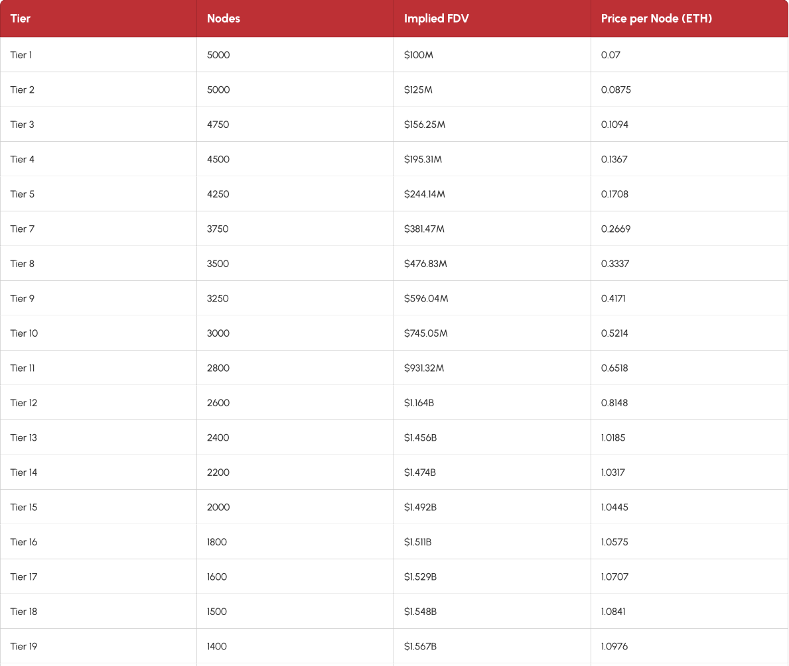

# Quranium-Node Key

### Description

The QNode-Key project aims to provide a seamless experience for users looking to acquire QNode-keys through a well-defined minting process. The contract supports a total supply of 88,888 QNode-keys, distributed across 77 tiers, with each wallet limited to claiming a maximum of 10 QNode-keys. This structure not only promotes fair distribution but also enhances user engagement by rewarding early adopters and loyal participants.

## Table of Contents

- [Installation](#installation)
- [Features](#features)
- [License](#license)
- [Contact](#contact)

## Installation

1. Clone the repository:
   ```bash
   git clone https://github.com/ggauranshi-03/qnodesell
   ```
2. Install dependencies:
   ```bash
   npm install
   ```
3. Run this locally at localhost:3000
   ```bash
   npm run dev
   ```

## Features

### Q-node-key distribution per tier

The QNodeKey project is designed to manage a total of 88,888 QNode-keys, distributed across 77 tiers. Each wallet can claim a maximum of 10 QNode-keys. This structure not only facilitates a tiered approach to minting but also encourages community participation through limited claims per wallet.

#### Key Features

##### Total Supply:

The project will mint a total of 88,888 QNode-keys, ensuring a controlled and finite number of tokens available in the ecosystem. This finite supply helps maintain value and exclusivity.

##### Tier System:

With 77 tiers, the project introduces a hierarchical structure that allows for differentiated pricing and features at each level. This tiered approach can enhance user engagement by providing incentives for early adopters and rewarding loyal participants.

##### Wallet Limitations:

To promote fair distribution and prevent hoarding, each wallet is limited to claiming a maximum of 10 QNode-keys. This limitation encourages broader participation from the community and ensures that more users can access the tokens.

The total number of nodes per tier decreases as the sale progresses, creating scarcity and driving demand.



[For more info click here](https://quranium.org/all-tiers-node-sales)

### Multiple token currency support

The QNodeKey project is designed to facilitate transactions using multiple cryptocurrencies, specifically supporting USDT, USDC, ETH, and WBTC. This multi-currency support enhances the flexibility and accessibility of the platform, allowing users to engage in node purchases using their preferred digital assets. Below is a detailed overview of the benefits and implications of this feature.

#### Supported Currencies

#### Tether (USDT):

A widely used stablecoin pegged to the US Dollar, USDT provides users with a stable value during transactions, minimizing volatility risks typically associated with cryptocurrencies. This makes it an attractive option for users looking to maintain value while participating in the QNodeKey ecosystem.

#### USD Coin (USDC):

Another stablecoin, USDC is fully backed by US Dollar reserves and is known for its transparency and regulatory compliance. By accepting USDC, QNodeKey appeals to users who prioritize security and stability in their digital transactions.

#### Ethereum (ETH):

As the native cryptocurrency of the Ethereum blockchain, ETH is essential for executing smart contracts and conducting transactions on the network. Supporting ETH allows users to leverage their existing holdings while participating in the QNodeKey project.

#### Wrapped Bitcoin (WBTC):

WBTC is an ERC20 token that represents Bitcoin on the Ethereum blockchain. By accepting WBTC, QNodeKey enables Bitcoin holders to engage with Ethereum-based applications seamlessly, bridging the gap between the two leading cryptocurrencies.

### Referral system: reward distribution

The QNodeKey project incorporates a referral system designed to incentivize both referrer and end client. This system is structured to ensure that rewards are fairly distributed, enhancing user engagement and promoting network growth. Below is a detailed explanation of the reward distribution mechanism within the referral system.

### Reward Allocation

#### Refferer Rewards:

20% of the Total Sale Price: When a node is purchased through a referral, 20% of the total sale price is allocated to the referrer. This reward serves as an incentive for users to actively promote the QNodeKey project, thereby expanding its reach and user base. The referrer's reward is calculated as follows:

    Refferer Reward = Total Price × 0.20

#### Customer Discounts:

5% Discount for End client: To encourage purchases through referrals, end customers who utilize a referral code receive a 5% discount on their total purchase price. This discount will foster loyalty and encourages repeat transactions. The discount is calculated as:

    Discount = Total Price × 0.05

### Multiple wallet connection

The QNode-Key project recognizes the importance of user flexibility and accessibility in the decentralized finance (DeFi) ecosystem. To enhance user experience, the platform supports multiple options for wallet connection, allowing users to interact seamlessly with the smart contract using their preferred digital wallets.

#### Supported Wallets

##### MetaMask:

Description: MetaMask is one of the most popular Ethereum wallets, providing users with an easy-to-use interface for managing their assets and interacting with decentralized applications (dApps).

##### WalletConnect:

Description: WalletConnect is an open-source protocol that enables users to connect their mobile wallets to dApps via QR code scanning or deep linking.

##### Coinbase Wallet:

Description: Coinbase Wallet is a user-friendly wallet that allows users to store cryptocurrencies and interact with dApps.

### Overview of the Q-Node Key Contract

#### QNodeKey contract has several key features:

#### 1 Total Supply and Tiers:

The contract defines a dynamic total supply of 10 QNode-keys, distributed across 2 tiers which can be adjusted by the owner through designated setter functions. Each tier can have a different price and characteristics, encouraging users to engage with the platform at various levels.

#### 2 Referral System:

Users can generate unique referral codes that allow them to earn rewards when others purchase tokens using their codes. This system incentivizes community engagement and helps expand the user base.

#### 3 Dynamic Pricing:

The price of each tier is set dynamically, starting at 0.01 ETH for the first tier and increasing with each subsequent tier.

#### The buyNode Function Explained

The buyNode function is central to the QNodeKey contract, allowing users to purchase QNode-keys while integrating a referral system and tier advancement mechanism. Here’s how it works:

1. Purchase Quantity Validation: Users specify how many QNode-keys they wish to buy. The function checks that this quantity is greater than zero and does not exceed the maximum allowed per wallet or the total supply.

####

2. Price Calculation: The function calculates the total price based on the current tier's pricing structure. If a valid referral code is provided, a discount is applied to the total price.

####

3. Referral Code Processing:
   If a user provides a referral code, the contract verifies its validity and ensures that the user is not referring themselves.
   A 5% discount on the total price is applied if the referral code is valid.
   Additionally, 20% of the total sale price is allocated as a reward for the referrer.

   ####

4. Minting Process:
   The function then proceeds to mint the specified quantity of QNode-keys.
   It keeps track of how many tokens have been minted within the current tier.
   If all tokens in the current tier are minted, it automatically advances to the next tier using an internal mechanism called "\_advanceTier".

   ####

5. Tier Advancement:
   The \_advanceTier function is called when all available tokens in a tier are sold out.
   This function increments the currentTier variable, allowing users to access higher tiers with potentially different pricing or features.
   It resets the count of minted tokens for the new tier.

   ####

6. Finalizing Transactions:
   After successful minting, if a referral was used, any accumulated rewards are transferred to the referrer.
   The transaction concludes by updating records for how many tokens each user has minted.

## License

This project is licensed under the MIT License.

## Contact

For inquiries, please reach out at business@quranium.org
